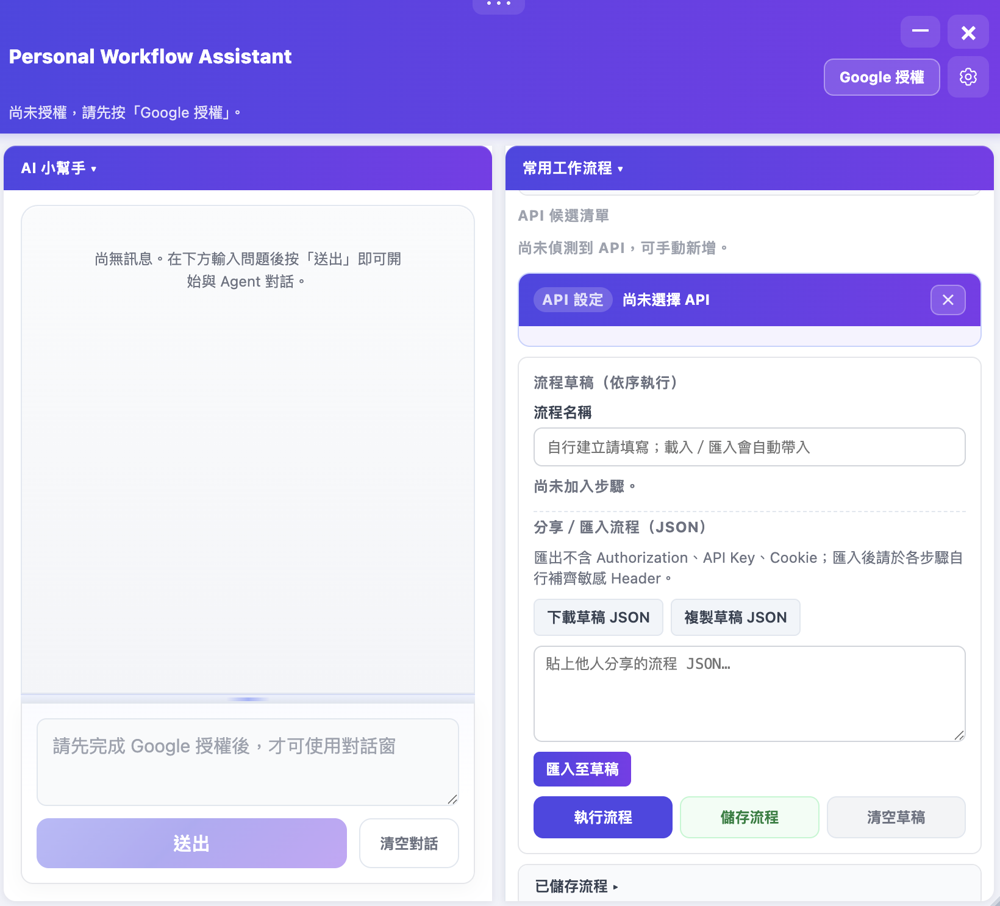
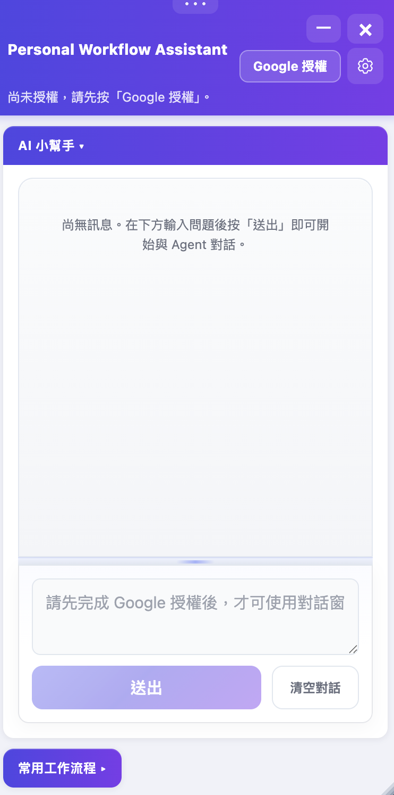

# Personal Workflow Assistant

嘗試全 AI 協作，讓自己抽離寫 code 的工程師，成為決策者的第一步。

## 專案介紹

Personal Workflow Assistant 是一個 Chrome Extension，
讓非工程人員可以透過 AI 對話執行 API 工作流程，
並將常用流程模板化後儲存與分享給團隊成員。

## 背景與動機

AM/PM 人員接收到客戶需求時，時常需要等待工程師協助執行腳本，
導致客戶等待時間拉長，也加重工程團隊負擔。

這個工具讓非工程人員可以：

- 透過 AI 對話取得應執行的 API 內容
- 將常用流程儲存為可重複執行的步驟
- 以 JSON 格式匯出／匯入流程，方便團隊傳承
- 匯出時自動排除敏感 Header（Authorization、API Key、Cookie）

## Screenshots

### Desktop



### Mobile



## 功能

- [x] AI 對話（串接自訂 AI Agent）
- [x] Google OAuth 授權
- [x] API 工作流程建立與執行
- [x] 流程 JSON 匯出 / 匯入
- [x] 流程儲存與分享
- [x] RWD 響應式設計

## 技術棧

- TypeScript、HTML、CSS（建置產出 JavaScript）
- Chrome Extension Manifest V3
- Google OAuth 2.0
- AI Agent API 串接（建置期由 `.env` 注入，執行期可於擴充內「設定」覆寫）

## 前置準備

在安裝前，你需要自行準備：

**1. GCP API 金鑰**

- 前往 Google Cloud Console
- 建立專案並啟用所需的 API
- 產生 API 金鑰填入設定

**2. Google OAuth 憑證**

- 在 GCP Console 建立 OAuth 2.0 用戶端 ID
- 類型選擇「Chrome 應用程式」
- 將你的 Extension ID 加入授權清單
- 把 Client ID 填入設定

## 安裝步驟

1. Clone 此 repo
2. 建置前設定 AI 與 Firebase／OAuth 等變數：複製 `.env.example` 為 `.env`，依專案慣例填入 `PERSONAL_EXT_AGENT_CHAT_URL_*` 等（詳見 `docs/env-and-secrets-pattern.md`）。若未設定 Agent URL，亦可於 `src/panel/constants.ts` 的 `LEGACY_FALLBACK_AGENT_CHAT_URL` 填入後備 API Endpoint。
3. 安裝依賴並建置（需 Node 22+，見 `.nvmrc`）：

   ```bash
   npm install
   npm run build
   ```

4. 在 Chrome 開啟 `chrome://extensions/`
5. 開啟「開發人員模式」
6. 點選「載入未封裝項目」，選擇此資料夾
7. 安裝完畢後，在擴充面板「設定」中填入／確認 GCP 金鑰與 Google OAuth Client ID 等（與建置預設或 `.env` 一致即可；執行期覆寫會優先於建置預設）
